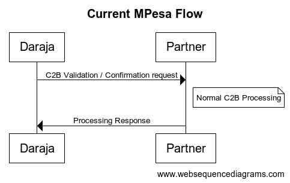

# Introduction

This is a short tutorial on how to quickly implement MNumber API in your system.

### NB: This is not a free API.

After [Safaricom PLC](imgs/notice.png)'s recent notice on minimization of data on the M-Pesa API (November 2023), MNumber is an API designed to simplify the adoption process by providing a quick API interface what will support MSISDN hash queries. Thus, instead of working on modification of the underlying system and databases, you just only need plug an API call just after receiving your C2B callback, and get the original mobile number to continue normal transaction processing i.e. **an external Database-as-a-Service for MPesa Partners**.

## Data Changes

Before the change, one received the MSISDN in the format `254XXX######`. With the new changes, one can now expect to receive the MSISDN as an SHA-256 hash of the original number e.g. given the sample callback below (both JSON and XML formats shown):

JSON:
```json
{    
   "TransactionType": "Pay Bill",
   ...
   "MSISDN":"254722000000",
   "FirstName":"John",
   "MiddleName":"",
   "LastName":"Doe"
}
```

XML:
```xml
<?xml version="1.0" encoding="utf-8" ?>
<soapenv:Envelope
    xmlns:soapenv="http://schemas.xmlsoap.org/soap/envelope/"
    xmlns:xsi="http://www.w3.org/2001/XMLSchema-instance">
    <soapenv:Body>
        <ns1:C2BPaymentValidationRequest
            xmlns:ns1="http://cps.huawei.com/cpsinterface/c2bpayment">
            <TransType>Pay Bill</TransType>
            
            <!-- other data -->
            
            <MSISDN>254722000000</MSISDN>
            <KYCInfo>
                <KYCName>[Personal Details][First Name]</KYCName>
                <KYCValue>John</KYCValue>
            </KYCInfo>
            <KYCInfo>
                <KYCName>[Personal Details][Last Name]</KYCName>
                <KYCValue>Doe</KYCValue>
            </KYCInfo>
        </ns1:C2BPaymentValidationRequest>
    </soapenv:Body>
</soapenv:Envelope>
```

One should now expect to receive the below (as of November 2023)

JSON:
```json
{    
   "TransactionType": "Pay Bill",
   ...
   "MSISDN":"8556a495c390f3ba95d2bdf6d06436f2fd09f516531f0a7cd9591c60812fa46d",
   "FirstName":"John"
}
```

XML:
```xml
<?xml version="1.0" encoding="utf-8" ?>
<soapenv:Envelope
    xmlns:soapenv="http://schemas.xmlsoap.org/soap/envelope/"
    xmlns:xsi="http://www.w3.org/2001/XMLSchema-instance">
    <soapenv:Body>
        <ns1:C2BPaymentValidationRequest
            xmlns:ns1="http://cps.huawei.com/cpsinterface/c2bpayment">
            <TransType>Pay Bill</TransType>
            
            <!-- other data -->
            
            <MSISDN>8556a495c390f3ba95d2bdf6d06436f2fd09f516531f0a7cd9591c60812fa46d</MSISDN>
            <KYCInfo>
                <KYCName>[Personal Details][First Name]</KYCName>
                <KYCValue>John</KYCValue>
            </KYCInfo>
        </ns1:C2BPaymentValidationRequest>
    </soapenv:Body>
</soapenv:Envelope>
```
Note the MSISDN has been changed into a hash in line with the requirements mentioned before. Also note the missing middle and last names too.

Currently, the MPesa flow is as shown below:



After implementation of MNumber API into your system, this will be the new flow:


That will eliminate the need to perform any major system or datastore changes on your end and save you a lot of time!

## Requirements

The API has been built to allow for ease of self-onboarding, with minimal user-interaction needed from the partner end. To use the API, the below are the details required:

- **Existing MPesa C2B Shortcode (Paybill or Store number)**: An existing shortcode on MPesa. Only those with existing C2B-enabled shortcodes will be allowed access to the system
- **MPesa API Operator/Initiator**: this will be used to verify ownership of an existing shortcode on MPesa. The operator should only have the Transaction Query permission enabled for them
- **Existing MPesa Transaction ID e.g. RB866#####**. This transaction will be queried to verify ownership of the shortcode via the operator. It has to be less than 6 months old or the verification will fail
- **Callback URL**: a one-time callback URL will be used to deliver verification results and/or the API credentials. It has to be publicly accessible, same as Daraja API callback URL, but can be disabled immediately after receiving MNumber API credentials

## Usage

There are only 2 API requests to work with:

### 1. Auth API

This is a one-time API call that enables one to get access to MNumber. It's structure is as below:

```
POST /mnumber/api/auth HTTP/1.1
Host: mnumber.proxyapi.app
Content-Type: application/json
Content-Length: 536

{
    "shortcode": "000000",
    "initiator_username": "initiator",
    "initiator_password": "FslVOQhyuFNuGt5/iHTrwv+jE0zfOq51TS8Ij/FB69bo89jAV7VI4ytFwrpap+v3mSZqE98QyJSjgUXDHOyP2CP34zkuj2CITbGQUVA9ghYrWMIY6nOlJpvqqOlF6GVDMDPRJWeOXDTq4TzK4jqt23uF7Krg++niZNW4jm3AzPlkGDtnaUPbgFGkrp8bidl4azVdwU5N+Nx0RXexLoW9u5nnnGTX6KjcqjS1IF0jnBh4U/nb9ckNGuH/jHISbJoJTAwDvMsaixENK2Wo6XOjWD8vNESF0GlQtK5wzoZYOmLkUJXmJia68iTghTKPbP/4RNvtxJRTjktzNptRvrXreQ==",
    "transaction_id": "RJQ0000000",
    "callback_url": "https://example.com/callback"
}
```

Each field corresponds directly to their MPesa equivalents of the same or similar names, thus should be straight forward. The above request sends a transaction query request to MPesa and gets back the status of the transaction. If the transaction exists and is valid, the shortcode is added to the system, and the result is sent to the callback URL. For more information, check out the [Transaction Query API](https://developer.safaricom.co.ke/APIs/TransactionStatus) on Daraja. Once sent, an acknowledgement will be sent as the request is processed asynchronously. The acknowledgement structure will be as below:

```json
{
    "status_code": "0",
    "status_message": "Accept the service request successfully.",
    "request_id": "cdcfd5f8-9a0d-4082-af95-3fbbf9e62902"
}
```

The `request_id` can be saved for future reference during the callback.

Once the request has been processed asynchronously, a callback is sent to the callback URL set in the first Auth request. The structure of the HTTP body for a successful callback request is as below. The `result_code` will be `"0"` (string) for a completed request:

```json
{
  "result_code": "0",
  "result_message": "The service request is processed successfully.",
  "request_id":"cdcfd5f8-9a0d-4082-af95-3fbbf9e62902",
  "shortcode": "000000",
  "username": "initiator",
  "api_key": "00000000-0000-0000-0000-000000000000",
  "api_secret": "12b9377cbe7e5c94e8a70d9d23929523d14afa954793130f8a3959c7b849aca8"
}
```

The `api_key` and `api_secret` are specific to the shortcode, and **should be kept confidential**. They shall be used with the Query API which we shall explain in the next section. Calling the Auth API multiple times will simply return the same data.

The format for a failed request will be as below. The `result_code` will be non-zero for any failed request:

```json
{
  "result_code": "2001",
  "result_message": "The initiator information is invalid.",
  "shortcode": "000000"
}
```

### 2. Query API

This is a request to fetch the original MSISDN for a given hash. The structure is as below:

```
POST /mnumber/api/query HTTP/1.1
Host: mnumber.proxyapi.app
ApiKey: 00000000-0000-0000-0000-000000000000
ApiPassword: ca5c5f68cf6ae2270bd6d3a12264e1ed5488b7afca0015ccf67da6a4962d53f7
ApiTimestamp: 1701078668
Content-Type: application/json
Content-Length: 171

{
    "shortcode": "000000",
    "msisdn_hash": "edc84a0d3664fa1d22f8133093a0218e51c0bbb0ce80a642c7885f4969071445"
}
```

- The `shortcode` is the Paybill or Store number used for registration in the previous Auth request. It is mandatory
- The `msisdn_hash` is the hash received in the validation/confirmation callback. It is mandatory.
- The `ApiKey` is the `api_key` value received in the previous Auth callback. This is set in the headers
- The `ApiTimestamp` is the Unix timestamp in seconds. Its set in the headers.
- The `ApiPassword` is a concatenation of the SHA256 hash of the (`ApiKey` + `api_secret` + `ApiTimestamp`), the `api_secret` being the value received in the Auth callback above e.g. using values received in Auth callback above, and the timestamp value of `1701078668`, the ApiPassword = `SHA256("00000000-0000-0000-0000-00000000000012b9377cbe7e5c94e8a70d9d23929523d14afa954793130f8a3959c7b849aca81701078668")` which will give you `ca5c5f68cf6ae2270bd6d3a12264e1ed5488b7afca0015ccf67da6a4962d53f7`. Its set in the headers.

A sample hashing code in Javascript is given in the Pre-request script of the Query API in the [MNumber Postman collection](mnumber_api.postman_collection.json) present in this repo.

Once sent, the request is processed synchronously, and the result received immediately. The structure for a successful response will be as below:

```json
{
    "status_code": "0",
    "status_message": "Success",
    "shortcode": "000000",
    "msisdn_hash": "8556a495c390f3ba95d2bdf6d06436f2fd09f516531f0a7cd9591c60812fa46d",
    "msisdn": "254722000000"
}
```

- The `shortcode` will always be present
- The `msisdn` will always be present
- The `msisdn_hash` will always be present

The status_code will always be `"0"` for successful requests.

For a failed request, the format is as below:

```json
{
    "status_code": "404",
    "status_message": "No such number"
}
```

Note the `status_code`, which will be non-zero for failed requests.

Check out the [MNumber Postman collection](mnumber_api.postman_collection.json) available in the repo to test out the API.

Contact [info.mnumber@gmail.com](mailto:info.mnumber@gmail.com) for queries and support or raise an issue in the [Issues](https://github.com/peternjeru/mnumber-tutorial/issues) section.

Copyright &copy;2023 Novacom Technologies Ltd.
